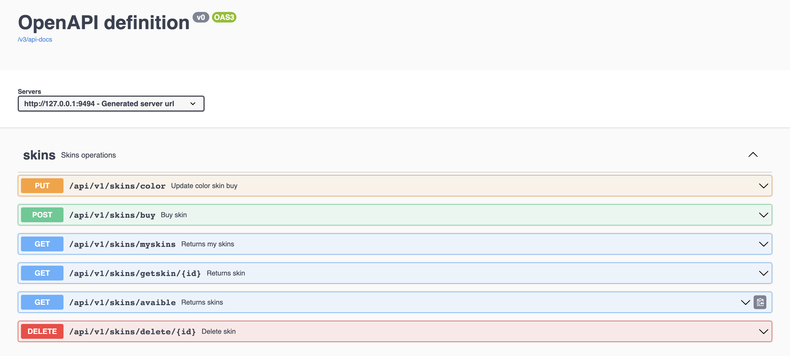

# Hackathon Jump - Aplicación Spring Boot con MySQL

Este repositorio contiene una aplicación Spring Boot que utiliza una base de datos MySQL para un hackathon llamado "Hackathon Jump". La aplicación Spring Boot se ejecuta en un contenedor Docker y se comunica con la base de datos MySQL también alojada en un contenedor Docker.

## Requisitos previos

Asegurarse de tener instalados los siguientes requisitos previos en tu sistema:

- [Docker](https://www.docker.com/get-started)
- [Docker Compose](https://docs.docker.com/compose/install/)

## Instrucciones de uso

Sigue estos pasos para ejecutar la aplicación en tu entorno local:

1. Clona este repositorio en tu máquina:
   ```bash
   git clone https://github.com/guillermosg28/hackaton-jump.git
   cd hackathon-jump
    ```
   
2. Ejecuta la aplicación Spring Boot y la base de datos MySQL en contenedores Docker:
   ```bash
   docker-compose up
   ```

3. Accede a la aplicación Spring Boot en tu navegador web en la siguiente URL: http://localhost:9494


4. Endpoints disponibles


